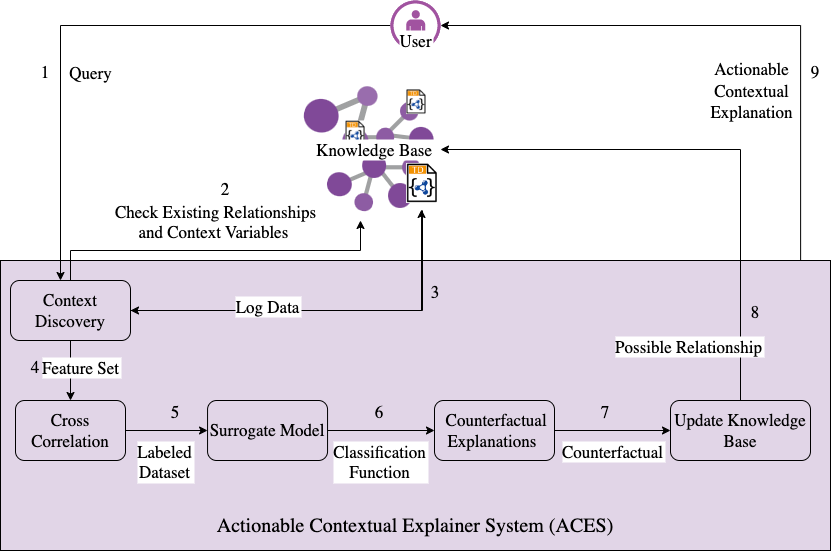

# Actionable Contextual Explanation System (ACES)



1. Setup the context and knowledge base

   1. Setup InfluxDB for gathering the data form the sensors
   2. Setup NodeRed for accessing those sensor data through REST methods
   3. Setup GraphDB to run SPARQL queries to retrieve the Thing Descriptions
      . Upload the knowledge graphs and ontologies to your GraphDB repository
2. Update the credentials in config.ini (rename the file config.ini.example to config.ini)
3. Install required packages for Python 3.8.2

   ```zsh
   python install -r requirements.txt
   ```
4. Run the system:

   a. Using the setup:

   ```zsh
   cd contextual_explainer/src/
   python main.py
   ```
   Example (simplified) of an interaction and the output of the system:

   ```macos
   Contextual Explanation System

   ---------Query-------------
   Enter name of the entity: RB30_OG4_61-400_standing_lamp_1
   Enter feature name for finding influence: lightPowerStatus
   Enter datetime of query instance: 2022-01-01T00:00:00Z

   ---------Context Discovery-
   Enter the ontology prefix used: hsg
   Enter the ontology uri: <http://semantics.interactions.ics.unisg.ch/livingcampus#>
   Enter the relationship name to discover the Thing Descriprions: hasLocation

   Surrogate model accuracy: 98.93%

   Select a counterfactual: 2 (index of the counterfactual, Light brightness level 0.7)

   Contextual Explanation:
   Room Temperature has positiveInfluence on light brightness Level of example_standing_lamp_1

   The preserved influences between hsg:example_standing_lamp_1 and brick:Temperature have been reviewed 16 times by the users as positiveInfluence

   Average ratings for the preserved contextual influence:
   {'positiveInfluence': 0.75, 'negativeInfluence': 0.0}

   Please provide your feedback for future reference by the users: The relationship looks plausible and it may be because the room was occupied by the employees at the given time.
   Do you agree with the found relationship? yes/no: yes
   ```
